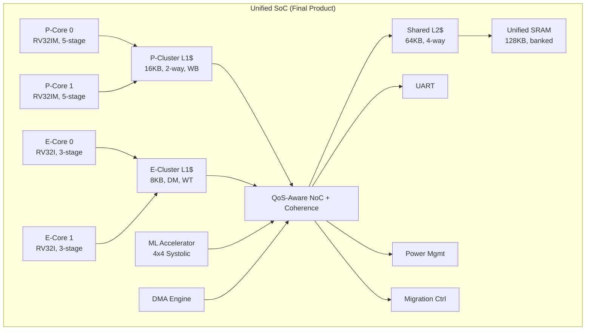

## Table of Contents

1. [Executive Summary & Recommendation](#1-executive-summary--recommendation)
2. [Project A1 — big.LITTLE Heterogeneous Multi-Core SoC](#2-project-a1--biglittle-heterogeneous-multi-core-soc)
3. [Project A2 — Unified Memory Architecture (UMA) SoC](#3-project-a2--unified-memory-architecture-uma-soc)
4. [Recommended Approach: Unified Build](#4-recommended-approach-unified-build)
5. [Phase-wise Roadmap](#5-phase-wise-roadmap)
6. [Detailed Timeline](#6-detailed-timeline)
7. [Reference Papers & Resources](#7-reference-papers--resources)
8. [Toolchain & Infrastructure Setup](#8-toolchain--infrastructure-setup)
9. [Verification & Testing Strategy](#9-verification--testing-strategy)
10. [Deliverables Checklist](#10-deliverables-checklist)
11. [Risk Analysis & Mitigation](#11-risk-analysis--mitigation)
12. [Appendix — File & Directory Structure](#12-appendix--file--directory-structure)

---


### ✅ Recommended Strategy: **Build Both as One Unified SoC**

> [!IMPORTANT]
> Instead of choosing one, **build A2 first as the foundation**, then **integrate A1's heterogeneous cores on top of the UMA fabric**. This gives you a single, impressive SoC that demonstrates both concepts.

**Build order:**
```
Phase 1-2: Build E-Core (simple RV32I) → validates basic CPU design
Phase 3:   Build P-Core (RV32IM, 5-stage, branch pred) → validates advanced pipeline
Phase 4:   Build UMA interconnect fabric (QoS NoC) → validates system bus
Phase 5:   Build cache hierarchy + coherence → ties cores to fabric  
Phase 6:   Build ML accelerator + DMA → adds UMA differentiation
Phase 7:   Task migration controller + power management → adds big.LITTLE magic
Phase 8:   Integration, verification, FPGA → polish and demonstrate
```

This approach is superior because:
- You **don't duplicate work** (shared caches, shared interconnect)
- You get a **single portfolio piece** that covers both concepts
- It mirrors **real Apple Silicon** which IS a big.LITTLE SoC with UMA

---

## 2. Project A1 — big.LITTLE Heterogeneous Multi-Core SoC

### 2.1 Architecture Deep-Dive

#### E-Core (Efficiency Core) — RV32I, 3-Stage Pipeline

```
┌──────────────────────────────────────────────┐
│              E-Core 3-Stage Pipeline          │
│                                              │
│   ┌─────────┐   ┌─────────┐   ┌─────────┐  │
│   │  FETCH  │──▶│ DECODE/ │──▶│EXECUTE/ │  │
│   │         │   │  REG RD │   │ MEM/WB  │  │
│   │ • PC    │   │ • Decode │   │ • ALU   │  │
│   │ • I-Mem │   │ • RegFile│   │ • D-Mem │  │
│   │ • PC+4  │   │ • Imm   │   │ • WB Mux│  │
│   │         │   │   Gen   │   │         │  │
│   └─────────┘   └─────────┘   └─────────┘  │
│                                              │
│   Hazard handling: stall + forward (EX→EX)   │
│   Branch: always predict not-taken, flush 1  │
│   No M-extension (multiply done in software) │
└──────────────────────────────────────────────┘
```

**Design decisions:**
- 3-stage merges decode/register-read and execute/memory/writeback
- Minimal forwarding paths (only EX→EX)
- No branch predictor hardware — static not-taken with 1-cycle penalty
- Low gate count target: < 5K LUTs on FPGA

#### P-Core (Performance Core) — RV32IM, 5-Stage Pipeline

```
┌────────────────────────────────────────────────────────────┐
│                  P-Core 5-Stage Pipeline                    │
│                                                            │
│  ┌──────┐  ┌──────┐  ┌──────┐  ┌──────┐  ┌──────┐       │
│  │FETCH │─▶│DECODE│─▶│ EXEC │─▶│ MEM  │─▶│  WB  │       │
│  │      │  │      │  │      │  │      │  │      │       │
│  │• PC  │  │• Dec │  │• ALU │  │• D$  │  │• Reg │       │
│  │• I$  │  │• RF  │  │• MUL │  │• Align│  │  WB  │       │
│  │• BHT │  │• Imm │  │• DIV │  │      │  │• MUX │       │
│  │• BTB │  │• Ctrl│  │• Br  │  │      │  │      │       │
│  └──────┘  └──────┘  └──────┘  └──────┘  └──────┘       │
│                                                            │
│  Hazard unit: full forwarding (EX→EX, MEM→EX, MEM→MEM)    │
│  Branch predictor: 2-bit saturating counter BHT (256 entry)│
│  M-extension: iterative MUL (4-cycle), DIV (32-cycle)      │
│  CSRs: mhartid, mcycle, minstret, custom perf counters     │
└────────────────────────────────────────────────────────────┘
```

**Design decisions:**
- Classic 5-stage with full data hazard forwarding
- 2-bit BHT with 256 entries (8-bit PC hash), BTB for target prediction
- MUL: Booth-encoded iterative multiplier (area-efficient, 4 cycles)
- DIV: Restoring division (32 cycles, interruptible)
- Performance counters: cycles, instructions retired, branch misses, cache misses

#### Cache Architecture

| Parameter | P-Core Cluster L1 | E-Core Cluster L1 |
|---|---|---|
| Size | 16 KB | 8 KB |
| Associativity | 2-way set-associative | Direct-mapped |
| Line size | 32 bytes | 32 bytes |
| Write policy | Write-back, write-allocate | Write-through, no-write-allocate |
| Replacement | LRU (1 bit per set) | N/A (direct-mapped) |
| Tag bits | `[31:14]` = 18 bits | `[31:13]` = 19 bits |
| Sets | 256 | 256 |
| Hit latency | 1 cycle | 1 cycle |
| Miss penalty | 4–8 cycles (L2 access) | 4–8 cycles (L2 access) |

**Shared L2 Cache:**
- 64 KB, 4-way set-associative
- Write-back, write-allocate
- 32-byte lines, 512 sets
- Inclusive policy (superset of all L1 contents)
- LRU replacement (pseudo-LRU with tree bits)

### 2.2 Coherence Protocol — MSI

```
        ┌─────────┐
        │    I    │ (Invalid)
        │         │
        └──┬───┬──┘
   BusRd  │   │  BusRdX
   ┌──────▼┐ ┌▼──────┐
   │   S   │ │   M   │
   │(Shared)│ │(Modif.)│
   └───┬───┘ └───┬───┘
       │         │
       └────┬────┘
         Snoop
         Invalidate
```

**State transitions (per cache line):**
- **I → S**: Processor read miss, BusRd issued, line fetched from L2/memory
- **I → M**: Processor write miss, BusRdX issued, line fetched with exclusive ownership
- **S → M**: Processor write hit on shared line, BusUpgr issued (invalidate other copies)
- **S → I**: Snooped BusRdX from other core — invalidate local copy
- **M → S**: Snooped BusRd from other core — flush dirty data, transition to shared
- **M → I**: Snooped BusRdX from other core — flush dirty data, invalidate

**Implementation approach:**
- Snooping-based (simpler than directory for 4 cores)
- Snoop filter at L2 level (bit vector tracking which L1s have each line)
- Atomic bus transactions (only one outstanding miss at a time per core)

### 2.3 Task Migration Controller

```
┌──────────────────────────────────────────────────────────┐
│                Task Migration FSM                        │
│                                                          │
│  ┌──────┐    trigger    ┌───────────┐                   │
│  │ IDLE │──────────────▶│SAVE_STATE │                   │
│  └──────┘               └─────┬─────┘                   │
│     ▲                         │ 32 regs + PC + CSRs     │
│     │                         ▼                         │
│     │                   ┌───────────┐                   │
│     │                   │ TRANSFER  │                   │
│     │                   └─────┬─────┘                   │
│     │                         │ Write to migration buf  │
│     │                         ▼                         │
│     │                   ┌───────────┐                   │
│     │                   │ RESTORE   │                   │
│     │                   └─────┬─────┘                   │
│     │                         │ Load regs + PC on dest  │
│     │   done                  ▼                         │
│     └─────────────────── ┌──────┐                       │
│                          │ DONE │                       │
│                          └──────┘                       │
│                                                          │
│  Migration triggers:                                     │
│  1. Perf counter: IPC < threshold for N cycles → P→E    │
│  2. Perf counter: IPC > threshold → E→P                 │
│  3. CSR write: software hint (OS scheduler request)      │
│  4. Power budget: thermal/power limit exceeded → P→E     │
│                                                          │
│  Migration buffer: 33 × 32-bit registers (x0–x31 + PC)  │
│  + mstatus, mepc, mcause (essential CSRs)                │
│  Total: ~140 bytes per migration                         │
└──────────────────────────────────────────────────────────┘
```

**Key implementation details:**
- Migration is **transparent to running software** — no OS support needed for basic operation
- Source core enters HALT state, destination core resumes from saved PC
- Interrupt vector table updated atomically during TRANSFER phase
- Migration latency budget: < 100 cycles (must be fast to be useful)

---

## 3. Project A2 — Unified Memory Architecture (UMA) SoC

### 3.1 QoS-Aware Interconnect Fabric

```
┌──────────────────────────────────────────────────────────────┐
│                    QoS-Aware NoC Fabric                       │
│                                                              │
│  Master Ports:                                               │
│  ┌────────┐  ┌────────┐  ┌────────┐  ┌────────┐            │
│  │  CPU   │  │  ML    │  │  DMA   │  │ Debug  │            │
│  │ Port 0 │  │ Port 1 │  │ Port 2 │  │ Port 3 │            │
│  │ Pri: 2 │  │ Pri: 3 │  │ Pri: 1 │  │ Pri: 0 │            │
│  └───┬────┘  └───┬────┘  └───┬────┘  └───┬────┘            │
│      │           │           │           │                  │
│  ┌───▼───────────▼───────────▼───────────▼───┐              │
│  │         Crossbar Arbiter                   │              │
│  │                                            │              │
│  │  Arbitration: Round-robin within same       │              │
│  │  priority, strict priority across levels    │              │
│  │                                            │              │
│  │  Anti-starvation: lower-priority masters    │              │
│  │  guaranteed 1 slot every 16 cycles          │              │
│  └───┬───────────┬───────────┬───────────┬───┘              │
│      │           │           │           │                  │
│  Slave Ports:                                                │
│  ┌───▼────┐  ┌───▼────┐  ┌───▼────┐  ┌───▼────┐           │
│  │  SRAM  │  │  UART  │  │ ML CSR │  │DMA CSR │           │
│  │Slave 0 │  │Slave 1 │  │Slave 2 │  │Slave 3 │           │
│  └────────┘  └────────┘  └────────┘  └────────┘           │
└──────────────────────────────────────────────────────────────┘
```

**Arbitration algorithm (pseudocode):**
```
for each cycle:
    pending = collect all valid master requests
    for priority_level in [3, 2, 1, 0]:  # highest first
        candidates = pending.filter(pri == priority_level)
        if candidates:
            if starvation_counter[lower_pri] >= 16:
                grant = starving_master  # anti-starvation
            else:
                grant = round_robin_next(candidates)
            break
```

### 3.2 ML Accelerator (Systolic Array MAC Unit)

```
┌────────────────────────────────────────────────────┐
│              ML Accelerator Block                   │
│                                                    │
│  CSR Interface (0x2000_0000 - 0x2000_00FF):        │
│  ┌──────────────────────────────────────────┐      │
│  │ 0x00: CTRL     [start, mode, irq_en]    │      │
│  │ 0x04: STATUS   [busy, done, error]       │      │
│  │ 0x08: SRC_ADDR [pointer to input data]   │      │
│  │ 0x0C: DST_ADDR [pointer to output data]  │      │
│  │ 0x10: WEIGHT_ADDR [pointer to weights]   │      │
│  │ 0x14: DIM      [matrix dimensions]       │      │
│  │ 0x18: QUANT    [quantization params]     │      │
│  └──────────────────────────────────────────┘      │
│                                                    │
│  Compute Datapath:                                 │
│  ┌──────────────────────────────────────┐          │
│  │      4×4 Systolic Array              │          │
│  │                                      │          │
│  │  ┌────┐ ┌────┐ ┌────┐ ┌────┐       │          │
│  │  │MAC │→│MAC │→│MAC │→│MAC │       │          │
│  │  └─┬──┘ └─┬──┘ └─┬──┘ └─┬──┘       │          │
│  │    ↓      ↓      ↓      ↓          │          │
│  │  ┌────┐ ┌────┐ ┌────┐ ┌────┐       │          │
│  │  │MAC │→│MAC │→│MAC │→│MAC │       │          │
│  │  └─┬──┘ └─┬──┘ └─┬──┘ └─┬──┘       │          │
│  │    ↓      ↓      ↓      ↓          │          │
│  │  ┌────┐ ┌────┐ ┌────┐ ┌────┐       │          │
│  │  │MAC │→│MAC │→│MAC │→│MAC │       │          │
│  │  └─┬──┘ └─┬──┘ └─┬──┘ └─┬──┘       │          │
│  │    ↓      ↓      ↓      ↓          │          │
│  │  ┌────┐ ┌────┐ ┌────┐ ┌────┐       │          │
│  │  │MAC │→│MAC │→│MAC │→│MAC │       │          │
│  │  └────┘ └────┘ └────┘ └────┘       │          │
│  │                                      │          │
│  │  Each MAC: acc += a[i] * b[j]       │          │
│  │  INT8 inputs, INT32 accumulator      │          │
│  └──────────────────────────────────────┘          │
│                                                    │
│  DMA read engine → feeds systolic array            │
│  DMA write engine → drains results to SRAM         │
│  Interrupt line → signals completion to CPU         │
└────────────────────────────────────────────────────┘
```

### 3.3 DMA Engine

```
┌────────────────────────────────────────────┐
│              DMA Engine                     │
│                                            │
│  CSR Interface (0x3000_0000):              │
│  ┌────────────────────────────────┐        │
│  │ 0x00: CTRL   [start, mode]    │        │
│  │ 0x04: STATUS [busy, done]     │        │
│  │ 0x08: SRC    [source addr]    │        │
│  │ 0x0C: DST    [dest addr]      │        │
│  │ 0x10: LEN    [transfer length]│        │
│  │ 0x14: STRIDE [src/dst stride] │        │
│  └────────────────────────────────┘        │
│                                            │
│  Transfer Modes:                           │
│  • Linear: contiguous block copy           │
│  • 2D Strided: row-by-row with stride      │
│  • Scatter-gather: descriptor chain        │
│                                            │
│  Features:                                 │
│  • Burst transfers (8-beat bursts)         │
│  • Interrupt on completion                  │
│  • Channel priority (if multi-channel)     │
└────────────────────────────────────────────┘
```

### 3.4 Unified Memory Map

```
 0x0000_0000 ┌──────────────────────┐
             │    Boot ROM (64KB)   │  Read-only, contains bootloader
 0x0000_FFFF └──────────────────────┘
 0x0001_0000 ┌──────────────────────┐
             │                      │
             │   Unified SRAM       │  Shared address space:
             │    (128 KB)          │  CPU, ML Accel, DMA all
             │                      │  access the SAME memory
             │  Bank 0: 0x0001_0000 │
             │  Bank 1: 0x0001_8000 │  Bank-interleaved for
             │  Bank 2: 0x0002_0000 │  parallel access
             │  Bank 3: 0x0002_8000 │
             │                      │
 0x0002_FFFF └──────────────────────┘
 0x1000_0000 ┌──────────────────────┐
             │    UART CSRs         │  Serial I/O
 0x1000_00FF └──────────────────────┘
 0x2000_0000 ┌──────────────────────┐
             │   ML Accel CSRs      │  Accelerator control
 0x2000_00FF └──────────────────────┘
 0x3000_0000 ┌──────────────────────┐
             │    DMA CSRs          │  DMA engine control
 0x3000_00FF └──────────────────────┘
 0x4000_0000 ┌──────────────────────┐
             │  Power Mgmt CSRs     │  Clock gating, DVFS
 0x4000_00FF └──────────────────────┘
 0x5000_0000 ┌──────────────────────┐
             │  Migration Ctrl CSRs │  Task migration
 0x5000_00FF └──────────────────────┘
```

---

## 4. Recommended Approach: Unified Build

### Why Merge A1 + A2



### Component Dependency Graph

```
E-Core (RV32I, 3-stage) ──────────────────────────────┐
    │                                                   │
    ▼                                                   │
P-Core (RV32IM, 5-stage) ─── needs E-Core as base     │
    │                                                   │
    ▼                                                   │
Interconnect Fabric ◄──────────────────────────────────┤
    │                                                   │
    ├──▶ L1 Caches (per cluster)                       │
    │       │                                           │
    │       ▼                                           │
    ├──▶ Coherence Controller (MSI snooping)            │
    │       │                                           │
    │       ▼                                           │
    ├──▶ Shared L2 Cache                                │
    │                                                   │
    ├──▶ ML Accelerator ◄──────────────────────────────┘
    │                                       (independent)
    ├──▶ DMA Engine
    │
    ├──▶ Power Management Unit
    │
    └──▶ Task Migration Controller
```

---

## 5. Phase-wise Roadmap

### Phase 0 — Environment & Foundations (Week 1)

**Goal**: Set up toolchain, learn SystemVerilog basics, run "hello world" simulations.

| Task | Details | Deliverable |
|---|---|---|
| Install Verilator | `sudo apt install verilator` or build from source (v5.x) | Working `verilator --version` |
| Install RISC-V toolchain | `riscv32-unknown-elf-gcc` cross-compiler | Compile a bare-metal C program |
| Install GTKWave | Waveform viewer for debugging | View a simple VCD trace |
| Install Yosys + nextpnr | (Optional) For synthesis estimates | Synthesize a counter module |
| Set up project structure | See [Appendix](#12-appendix--file--directory-structure) | Git repo initialized |
| Study RV32I spec | Read RISC-V Unprivileged ISA Manual Ch. 2, 19, 24 | Notes on instruction formats |
| Write a basic ALU | 32-bit ALU with ADD, SUB, AND, OR, XOR, SLT, shifts | Testbench passing all ops |

> [!TIP]
> Start a lab notebook (markdown file or Notion) from Day 1. Document every design decision, bug, and insight. This becomes invaluable for interviews and write-ups.

---

### Phase 1 — E-Core: Simple RV32I Core (Weeks 2–4)

**Goal**: Fully functional 3-stage pipelined RV32I core executing bare-metal code.

#### Week 2: Single-Cycle Prototype
| Task | Details |
|---|---|
| Instruction memory | ROM-based, load from hex file |
| Register file | 32 × 32-bit, 2-read 1-write, x0 hardwired to 0 |
| Immediate generator | I, S, B, U, J type extraction |
| ALU | All RV32I arithmetic/logic ops |
| Control decoder | Opcode → control signals |
| Single-cycle datapath | All wired together, no pipeline |
| Testbench | Run `addi`, `add`, `sub`, `and`, `or`, `beq`, `jal` |

#### Week 3: Pipeline the Design (3-Stage)
| Task | Details |
|---|---|
| Pipeline registers | IF/ID and ID/EX stage registers |
| Hazard detection | Data hazards: stall on load-use |
| Forwarding unit | EX→EX forwarding path |
| Branch handling | Flush on taken branch (1-cycle penalty) |
| Memory interface | Separate I-mem and D-mem ports |
| Pipeline testbench | Run sequences with hazards, branches |

#### Week 4: Validation & Polish
| Task | Details |
|---|---|
| RISC-V compliance tests | Run `riscv-tests` suite (rv32ui) |
| Performance counters | `mcycle`, `minstret` CSRs |
| Trap handling | Illegal instruction trap, `ecall` |
| Code review | Clean up, add documentation |

**Exit criteria**: E-Core passes all rv32ui compliance tests, runs a bubble sort program correctly.

---

### Phase 2 — P-Core: Advanced RV32IM Core (Weeks 5–7)

**Goal**: 5-stage pipeline with branch prediction and M-extension.

#### Week 5: 5-Stage Pipeline
| Task | Details |
|---|---|
| Extend to 5 stages | Split: IF → ID → EX → MEM → WB |
| Full forwarding | EX→EX, MEM→EX, MEM→MEM paths |
| Load-use hazard | Stall 1 cycle (detect in ID, stall IF+ID) |
| Branch resolution | Resolve in EX stage, flush IF+ID on mispredict |
| Testbench | All rv32ui tests must pass |

#### Week 6: Branch Prediction + M-Extension
| Task | Details |
|---|---|
| 2-bit BHT | 256-entry table, indexed by PC[9:2] |
| BTB | 64-entry direct-mapped branch target buffer |
| Mispredict recovery | Flush pipeline, restore PC, update BHT |
| MUL instruction | Booth-encoded iterative multiplier (4 cycles) |
| MULH, MULHSU, MULHU | Upper-half multiply variants |
| DIV, DIVU, REM, REMU | Restoring divider (32 cycles, pipelined stall) |
| M-extension tests | Run rv32um compliance tests |

#### Week 7: Performance & Comparison
| Task | Details |
|---|---|
| Performance counters | Branch miss rate, IPC, stall cycles |
| Benchmark programs | Dhrystone, Coremark (bare-metal port) |
| P-Core vs E-Core comparison | Run same workload, measure CPI, total cycles |
| Documentation | Microarchitecture document with diagrams |

**Exit criteria**: P-Core passes rv32ui + rv32um tests, runs Dhrystone with measurable IPC.

---

### Phase 3 — Cache Subsystem (Weeks 8–9)

**Goal**: L1 caches for both clusters + shared L2 cache.

#### Week 8: L1 Caches
| Task | Details |
|---|---|
| E-Core L1 | 8KB direct-mapped, write-through, 32B lines |
| P-Core L1 | 16KB 2-way SA, write-back, 32B lines, LRU |
| Cache controller FSM | IDLE → COMPARE_TAG → ALLOCATE → WRITE_BACK |
| Tag/data arrays | SRAM-style arrays with read/write ports |
| Integration | Connect L1 to core memory interface |
| Testbench | Hit/miss sequences, write-back verification |

#### Week 9: Shared L2 Cache
| Task | Details |
|---|---|
| L2 cache | 64KB, 4-way SA, write-back, inclusive |
| L2 controller | Handles L1 miss requests, memory access |
| Pseudo-LRU | Tree-based replacement policy |
| Memory controller | Simple SRAM controller (1-cycle access) |
| Integration test | Multi-level cache access patterns |

**Exit criteria**: Cores run programs through cache hierarchy. Miss rates measurable.

---

### Phase 4 — Interconnect & Coherence (Weeks 10–11)

**Goal**: QoS-aware bus fabric and MSI coherence protocol.

#### Week 10: Interconnect Fabric
| Task | Details |
|---|---|
| Bus interface | AXI4-Lite compatible (simplified) |
| Address decoder | Route requests to correct slave |
| Arbiter | Priority-based with round-robin and anti-starvation |
| QoS registers | Programmable priority per master |
| Crossbar | N-master × M-slave switch fabric |
| Testbench | Multi-master contention scenarios |

#### Week 11: Cache Coherence (MSI)
| Task | Details |
|---|---|
| Snoop bus | Broadcast snoops from L2 to all L1s |
| MSI state machine | Per-line state: Invalid, Shared, Modified |
| Snoop filter | Bit vector at L2 level (which L1 has each line) |
| Coherence actions | BusRd, BusRdX, BusUpgr, Flush |
| Coherence tests | Producer-consumer across cores, ping-pong test |
| Deadlock testing | Multiple cores accessing same line simultaneously |

**Exit criteria**: Two cores can correctly share data through coherent caches. Producer-consumer test passes.

---

### Phase 5 — UMA Components: ML Accelerator & DMA (Weeks 12–13)

**Goal**: ML accelerator and DMA engine accessible via unified address space.

#### Week 12: ML Accelerator
| Task | Details |
|---|---|
| CSR interface | Memory-mapped control/status registers |
| 4×4 systolic array | INT8 multiply, INT32 accumulate |
| Data fetch unit | Read input/weight matrices from SRAM via fabric |
| Result write unit | Write output matrix back to SRAM |
| Interrupt generation | Signal completion to CPU |
| Testbench | 4×4 matrix multiply, compare with golden result |

#### Week 13: DMA Engine
| Task | Details |
|---|---|
| DMA controller | CSR-programmed, linear + strided transfers |
| Bus master interface | Issues read/write bursts on fabric |
| Burst support | 8-beat bursts for efficient SRAM access |
| Interrupt on completion | Signal CPU when transfer done |
| Integration test | CPU programs DMA, DMA moves data, CPU verifies |
| UMA demo | CPU → SRAM → ML Accel → SRAM → CPU (zero-copy) |

**Exit criteria**: Full UMA data flow demonstrated. CPU programs ML accelerator with pointers, accelerator processes data in-place, CPU reads result — no copies.

---

### Phase 6 — System Integration: big.LITTLE + UMA (Week 14)

**Goal**: All components connected and working together.

| Task | Details |
|---|---|
| SoC top module | Instantiate all components, wire together |
| Boot sequence | E-Core 0 boots from ROM, initializes system |
| Multi-core startup | Each core reads `mhartid`, branches to its code |
| UART integration | Printf-style debug output |
| Interrupt controller | Simple PLIC-like interrupt routing |
| System-level tests | Boot → run tasks on all cores → UART output |

---

### Phase 7 — Task Migration & Power Management (Weeks 15–16)

**Goal**: Complete the big.LITTLE experience with dynamic task migration.

#### Week 15: Task Migration Controller
| Task | Details |
|---|---|
| Migration FSM | IDLE → SAVE → TRANSFER → RESTORE → DONE |
| State save/restore | Read 32 regs + PC from source, write to dest |
| Migration buffer | Dedicated SRAM region for migration state |
| Performance monitor | IPC counter with threshold comparison |
| Software trigger | CSR write to initiate migration |
| Migration test | Run task on P-Core, trigger migration to E-Core, verify state |

#### Week 16: Power Management
| Task | Details |
|---|---|
| Clock gating | Per-core clock enable/disable |
| Power domains | Separate enable for P-cluster and E-cluster |
| DVFS stub | CSR to select frequency divider (1×, 2×, 4×) |
| Wake-on-interrupt | Sleeping core wakes on interrupt assertion |
| Power demo | Run workload, show dynamic P↔E switching |

---

### Phase 8 — Verification, FPGA, Documentation (Weeks 17–18)

**Goal**: Production-quality verification, optional FPGA demo, portfolio-ready documentation.

#### Week 17: Verification
| Task | Details |
|---|---|
| Full regression | All unit tests + integration tests |
| Formal verification | (Optional) Use SymbiYosys for cache coherence properties |
| Coverage analysis | Statement/branch coverage via Verilator |
| Stress tests | Random traffic generators for interconnect |
| Bug fixes | Fix all outstanding issues |

#### Week 18: FPGA & Documentation
| Task | Details |
|---|---|
| FPGA synthesis | Target Arty A7-35T or DE10-Lite |
| Resource report | LUT, FF, BRAM utilization |
| Timing report | Maximum clock frequency achieved |
| FPGA demo | LED blink via core migration, UART terminal |
| Project documentation | Architecture doc, microarch doc, user guide |
| Portfolio presentation | Block diagrams, performance results, lessons learned |

---

## 6. Detailed Timeline

```
Week  1  ████████░░░░░░░░░░░░░░░░░░░░  Phase 0: Setup & Foundations
Week  2  ░░░░░░░░████████░░░░░░░░░░░░░  Phase 1: E-Core (3-stage RV32I)
Week  3  ░░░░░░░░████████░░░░░░░░░░░░░      ├── Pipeline implementation
Week  4  ░░░░░░░░████████░░░░░░░░░░░░░      └── Validation
Week  5  ░░░░░░░░░░░░░░░░████████░░░░░  Phase 2: P-Core (5-stage RV32IM)
Week  6  ░░░░░░░░░░░░░░░░████████░░░░░      ├── Branch pred + M-ext
Week  7  ░░░░░░░░░░░░░░░░████████░░░░░      └── Performance benchmarks
Week  8  ░░░░░░░░░░░░░░░░░░░░░░░░██░░░  Phase 3: Cache Subsystem
Week  9  ░░░░░░░░░░░░░░░░░░░░░░░░██░░░      └── L1 + L2 caches
Week 10  ░░░░░░░░░░░░░░░░░░░░░░░░░░██░  Phase 4: Interconnect + Coherence
Week 11  ░░░░░░░░░░░░░░░░░░░░░░░░░░██░      └── MSI protocol
Week 12  ░░░░░░░░░░░░░░░░░░░░░░░░░░░░█  Phase 5: ML Accel + DMA
Week 13  ░░░░░░░░░░░░░░░░░░░░░░░░░░░░█      └── UMA data flow
Week 14  ░░░░░░░░░░░░░░░░░░░░░░░░░░░░█  Phase 6: SoC Integration
Week 15  ░░░░░░░░░░░░░░░░░░░░░░░░░░░░█  Phase 7: Migration + Power
Week 16  ░░░░░░░░░░░░░░░░░░░░░░░░░░░░█      └── Power management
Week 17  ░░░░░░░░░░░░░░░░░░░░░░░░░░░░█  Phase 8: Verification + FPGA
Week 18  ░░░░░░░░░░░░░░░░░░░░░░░░░░░░█      └── Documentation + Portfolio
```

### Time Commitment Estimates

| Phase | Weeks | Hours/Week | Total Hours | Difficulty |
|---|---|---|---|---|
| 0 — Setup | 1 | 15–20 | 15–20 | ★☆☆☆☆ |
| 1 — E-Core | 3 | 20–25 | 60–75 | ★★★☆☆ |
| 2 — P-Core | 3 | 20–25 | 60–75 | ★★★★☆ |
| 3 — Caches | 2 | 20–25 | 40–50 | ★★★★☆ |
| 4 — Interconnect + Coherence | 2 | 25–30 | 50–60 | ★★★★★ |
| 5 — ML Accel + DMA | 2 | 20–25 | 40–50 | ★★★☆☆ |
| 6 — Integration | 1 | 25–30 | 25–30 | ★★★★☆ |
| 7 — Migration + Power | 2 | 20–25 | 40–50 | ★★★★☆ |
| 8 — Verification + FPGA | 2 | 20–25 | 40–50 | ★★★☆☆ |
| **Total** | **18** | | **370–460** | |

> [!NOTE]
> This timeline assumes ~20–25 hours/week of focused work. If working full-time on this (40+ hrs/week), you can compress to **10–12 weeks**. If part-time alongside a job or school (10–15 hrs/week), budget **24–30 weeks**.

### Minimum Viable Product (MVP) — 8 Weeks

If time-constrained, here's what to build for a compelling but smaller demo:

| Week | Deliverable |
|---|---|
| 1 | Setup + ALU |
| 2–3 | E-Core (3-stage RV32I) |
| 4–5 | P-Core (5-stage RV32IM with branch prediction) |
| 6 | Direct-mapped L1 caches (no L2, no coherence) |
| 7 | Simple bus fabric + UART + SRAM |
| 8 | SoC integration + documentation |

This MVP gives you a **dual-core heterogeneous SoC** without the full UMA/coherence complexity, which is still very impressive for a portfolio project.

---

## 7. Reference Papers & Resources

### 7.1 Core Architecture & RISC-V

| Resource | Type | Why You Need It |
|---|---|---|
| **"Computer Organization and Design: RISC-V Edition"** — Patterson & Hennessy | Textbook | Gold standard. Chapters on pipeline, hazards, caches. Start here. |
| **RISC-V Unprivileged ISA Specification (v20191213)** | Spec | Official instruction encoding, formats, semantics. Keep open at all times. |
| **RISC-V Privileged Architecture Specification** | Spec | CSRs, traps, interrupts — needed for Phase 1+ |
| "RISC-V Instruction Formats" quick reference card | Cheat sheet | Print it out. You'll reference it 100 times. |
| **"Computer Architecture: A Quantitative Approach"** — Hennessy & Patterson | Textbook | Advanced: branch prediction, out-of-order, memory hierarchy |

**Online:**
- RISC-V Spec: https://riscv.org/technical/specifications/
- RISC-V Tests: https://github.com/riscv-software-src/riscv-tests
- RISC-V GNU Toolchain: https://github.com/riscv-collab/riscv-gnu-toolchain

### 7.2 Cache Design & Coherence

| Resource | Type | Why You Need It |
|---|---|---|
| **"A Primer on Memory Consistency and Cache Coherence" (2nd Ed.)** — Sorin, Hill, Wood | Textbook | The definitive guide to coherence. Chapters 6–8 on snooping protocols. Free from Morgan & Claypool. |
| **"Cache Coherence Protocols" chapter in Hennessy & Patterson** | Textbook chapter | Practical MSI/MESI/MOESI with worked examples |
| **Sorin et al., "A Primer on Memory Consistency and Cache Coherence"** | Tutorial | Start here for coherence. Available free online from the Synthesis Lectures series. |
| J. L. Hennessy and D. A. Patterson, "Memory Hierarchy Design" (Chapter 5, CAQA) | Textbook chapter | Cache design parameters, miss rate analysis |

### 7.3 big.LITTLE / Heterogeneous Multi-Core

| Resource | Type | Why You Need It |
|---|---|---|
| **ARM big.LITTLE Technology White Paper** | White paper | ARM's official design rationale and architecture |
| **"big.LITTLE Processing with ARM Cortex-A15 & Cortex-A7"** — Brian Jeff (ARM) | Tech report | Implementation details of the original big.LITTLE |
| **P. Greenhalgh, "big.LITTLE Processing with ARM Cortex-A15 & Cortex-A7"** (ARM, 2011) | White paper | Foundational document on asymmetric multi-core |
| **"Scheduling Heterogeneous Multi-Cores through Performance Impact Estimation (PIE)"** — Van Craeynest et al. (ISCA 2012) | Paper | Academic perspective on heterogeneous scheduling |
| **"Bias Scheduling in Heterogeneous Multi-Core Architectures"** — Koufaty et al. (EuroSys 2010) | Paper | How to decide which core to run a task on |
| **R. Kumar et al., "Single-ISA Heterogeneous Multi-Core Architectures: The Potential for Processor Power Reduction"** (MICRO 2003) | Paper | Seminal paper proving the perf/watt benefits of heterogeneous cores |
| **Apple M1 Die Analysis** — Anandtech (2020) | Article | Real-world implementation of P/E-core concepts |

### 7.4 Unified Memory Architecture

| Resource | Type | Why You Need It |
|---|---|---|
| **"A New Approach to Memory System Design: Unified Memory Architecture"** | Various | Search for UMA-related AMD/NVIDIA/Apple technical papers |
| **Apple M1 Deep Dive** — Anandtech | Article | How Apple implements UMA across CPU/GPU/Neural Engine |
| **"On-Chip Interconnection Networks"** — Peh, Jerger, Kundu | Textbook | NoC design, arbitration, QoS |
| **ARM AMBA AXI Protocol Specification** | Spec | Industry-standard bus protocol (your fabric will be AXI-like) |
| **"Efficient NoC Design for Heterogeneous SoCs"** — various IEEE papers | Papers | QoS, virtual channels, and arbitration strategies |

### 7.5 ML Accelerator / Systolic Array

| Resource | Type | Why You Need It |
|---|---|---|
| **"In-Datacenter Performance Analysis of a Tensor Processing Unit"** — Jouppi et al. (Google, ISCA 2017) | Paper | How Google's TPU systolic array works |
| **"Eyeriss: An Energy-Efficient Reconfigurable Accelerator for DNNs"** — Chen et al. (MIT, ISCA 2016) | Paper | Spatial architecture for neural networks |
| **"Why Systolic Architectures?"** — H.T. Kung (1982) | Paper | Foundational paper on systolic arrays |
| **"A Dataflow Processing Chip for Training Deep Neural Networks"** — NVIDIA | Paper | Modern perspective on training accelerators |

### 7.6 Verification & Formal Methods

| Resource | Type | Why You Need It |
|---|---|---|
| **Verilator User Guide** | Docs | Your primary simulation tool |
| **SymbiYosys** (formal verification frontend for Yosys) | Tool | Optional but very impressive for coherence verification |
| **"Formal Verification of Cache Coherence Protocols"** — various | Papers | Shows how to formally verify MSI/MESI |
| **"RISC-V Formal Verification Framework"** | GitHub | Community tools for verifying RISC-V cores |
| Clifford Wolf's **riscv-formal** | GitHub | Formal verification infrastructure for RISC-V |

### 7.7 FPGA Resources

| Resource | Type | Why You Need It |
|---|---|---|
| **Digilent Arty A7-35T** | Dev board | Affordable Xilinx Artix-7 FPGA, ~33K LUTs |
| **Intel DE10-Lite** | Dev board | Intel MAX 10 FPGA alternative |
| **Vivado Design Suite** (Xilinx) | Tool | Free for Artix-7 targets |
| **Quartus Prime Lite** (Intel) | Tool | Free for MAX 10 targets |

---

## 8. Toolchain & Infrastructure Setup

### 8.1 Required Software

```bash
# === SIMULATION ===
# Verilator (SystemVerilog simulator — FAST)
sudo apt install verilator
# or build from source for latest:
git clone https://github.com/verilator/verilator
cd verilator && autoconf && ./configure && make -j$(nproc) && sudo make install

# === RISC-V CROSS COMPILER ===
# Pre-built (Ubuntu/Debian):
sudo apt install gcc-riscv64-unknown-elf
# Or build riscv32 toolchain from source:
git clone https://github.com/riscv-collab/riscv-gnu-toolchain
cd riscv-gnu-toolchain
./configure --prefix=/opt/riscv --with-arch=rv32im --with-abi=ilp32
make -j$(nproc)

# === WAVEFORM VIEWER ===
sudo apt install gtkwave

# === SYNTHESIS (Optional) ===
# Yosys (open-source synthesis):
sudo apt install yosys
# SymbiYosys (formal verification):
git clone https://github.com/YosysHQ/sby

# === BUILD SYSTEM ===
sudo apt install make cmake python3

# === VERSION CONTROL ===
sudo apt install git
```

### 8.2 Verification Infrastructure

```bash
# RISC-V Compliance Tests
git clone https://github.com/riscv-software-src/riscv-tests
cd riscv-tests && git submodule update --init --recursive

# Build tests for rv32ui (user-mode integer tests):
cd isa
make rv32ui    # generates .hex files for simulation

# RISC-V Formal Verification (optional but impressive)
git clone https://github.com/SymbioticEDA/riscv-formal
```

### 8.3 Makefile Template

```makefile
# Top-level Makefile for SoC project
VERILATOR = verilator
VERILATOR_FLAGS = --cc --exe --build -Wall --trace

# Directories
RTL_DIR = rtl
TB_DIR  = tb
BUILD   = build

# Targets
.PHONY: e_core p_core soc clean

e_core:
	$(VERILATOR) $(VERILATOR_FLAGS) \
		-I$(RTL_DIR)/e_core \
		$(RTL_DIR)/e_core/e_core_top.sv \
		$(TB_DIR)/tb_e_core.cpp \
		-o $(BUILD)/e_core_sim

p_core:
	$(VERILATOR) $(VERILATOR_FLAGS) \
		-I$(RTL_DIR)/p_core \
		$(RTL_DIR)/p_core/p_core_top.sv \
		$(TB_DIR)/tb_p_core.cpp \
		-o $(BUILD)/p_core_sim

soc:
	$(VERILATOR) $(VERILATOR_FLAGS) \
		-I$(RTL_DIR) \
		$(RTL_DIR)/soc_top.sv \
		$(TB_DIR)/tb_soc.cpp \
		-o $(BUILD)/soc_sim

clean:
	rm -rf $(BUILD) obj_dir
```

---

## 9. Verification & Testing Strategy

### 9.1 Verification Hierarchy

```
┌─────────────────────────────────────────────────┐
│           Level 4: System Integration            │
│  Boot sequence, multi-core programs, UMA demo    │
├─────────────────────────────────────────────────┤
│           Level 3: Subsystem Tests               │
│  Cache coherence, interconnect contention,       │
│  migration sequences                             │
├─────────────────────────────────────────────────┤
│           Level 2: Module Integration             │
│  Core + cache, fabric + slaves, accel + SRAM     │
├─────────────────────────────────────────────────┤
│           Level 1: Unit Tests                     │
│  ALU, regfile, decoder, cache controller,        │
│  arbiter, MAC unit, DMA FSM                      │
└─────────────────────────────────────────────────┘
```

### 9.2 Key Test Scenarios

#### CPU Core Tests
- [ ] All RV32I instructions (via `riscv-tests` suite)
- [ ] All RV32M instructions (P-Core only)
- [ ] Data hazard sequences: `add x1,x2,x3 ; add x4,x1,x5` (RAW)
- [ ] Load-use hazard: `lw x1,0(x2) ; add x3,x1,x4` (stall required)
- [ ] Branch sequences: taken, not-taken, back-to-back
- [ ] Branch prediction accuracy test (P-Core): loop with known pattern
- [ ] Trap handling: illegal instruction, ecall

#### Cache Tests
- [ ] Cold miss → compulsory miss fills line
- [ ] Hit after fill → data returned in 1 cycle
- [ ] Capacity miss → eviction of LRU line
- [ ] Write-back: dirty line evicted → write to next level
- [ ] Write-through: every store visible at next level immediately
- [ ] Tag match with different offsets within same line

#### Coherence Tests
- [ ] **Producer-consumer**: Core 0 writes X, Core 1 reads X → must see latest value
- [ ] **Ping-pong**: Core 0 and Core 1 alternate writes to same line → correct MSI transitions
- [ ] **False sharing**: Two cores write to different words in same line → coherence overhead
- [ ] **Invalidation storm**: One core writes, all others' copies invalidated
- [ ] **Dirty sharing**: Core 0 modifies line (M), Core 1 reads → flush + transition to S

#### Interconnect Tests
- [ ] Single master, single slave: basic read/write
- [ ] Multi-master contention: two masters request same slave simultaneously
- [ ] QoS priority: high-priority master wins arbitration over low-priority
- [ ] Anti-starvation: low-priority master eventually gets service
- [ ] Address decode: requests routed to correct slave
- [ ] Back-to-back transactions: no dead cycles between grants

#### UMA Data Flow Tests
- [ ] CPU writes matrix to SRAM → programs ML Accel → reads result from SRAM
- [ ] DMA transfer: CPU programs DMA, data moved correctly
- [ ] Concurrent access: CPU and ML Accel access SRAM simultaneously
- [ ] Zero-copy verification: no intermediate buffer used

#### Task Migration Tests
- [ ] Basic migration: save state on Core 0, restore on Core 1, program continues correctly
- [ ] Register preservation: all 32 registers match after migration
- [ ] PC preservation: execution resumes at correct instruction
- [ ] Performance-triggered migration: IPC drops below threshold → auto-migrate P→E
- [ ] Software-triggered migration: CSR write triggers migration
- [ ] Back-migration: P→E→P round-trip preserves state

---

## 10. Deliverables Checklist

### Design Artifacts
- [ ] RTL source code (SystemVerilog) for all modules
- [ ] Testbenches (SystemVerilog + C++ for Verilator)
- [ ] Synthesis scripts (Yosys / Vivado)
- [ ] FPGA constraint files (.xdc or .sdc)
- [ ] Linker scripts and startup code for bare-metal programs

### Documentation
- [ ] **Architecture Specification** — High-level block diagrams, memory map, feature list
- [ ] **Microarchitecture Document** — Detailed pipeline diagrams, FSMs, timing diagrams
- [ ] **Verification Plan** — Test scenarios, expected results, coverage targets
- [ ] **Performance Report** — CPI, IPC, branch prediction accuracy, cache miss rates
- [ ] **FPGA Utilization Report** — LUTs, FFs, BRAMs, max frequency
- [ ] **Lessons Learned** — Design trade-offs, bugs encountered, what you'd do differently

### Demo Programs
- [ ] "Hello World" via UART (boot test)
- [ ] Bubble sort (pipeline hazard exercise)
- [ ] Matrix multiply (ML Accel vs. CPU comparison)
- [ ] Producer-consumer (coherence demo)
- [ ] Task migration demo (compute on P-Core, migrate to E-Core)
- [ ] Dhrystone / CoreMark benchmark

### Portfolio Presentation
- [ ] 1-page project summary (for resume)
- [ ] Architecture block diagram (clean, presentation-quality)
- [ ] GitHub README with build instructions
- [ ] Blog post or write-up explaining design decisions
- [ ] (Optional) Short demo video showing FPGA running

---

## 11. Risk Analysis & Mitigation

| Risk | Likelihood | Impact | Mitigation |
|---|---|---|---|
| **Cache coherence bugs** | High | High | Start with simple MSI, add extensive coherence tests, consider formal verification |
| **Pipeline hazard bugs** | Medium | High | Use RISC-V compliance test suite early and often |
| **Interconnect deadlocks** | Medium | High | Use a proven arbitration scheme, test with random traffic generators |
| **Scope creep** | High | Medium | Define MVP clearly (see Section 6), resist adding features before MVP works |
| **FPGA doesn't fit** | Medium | Medium | Run synthesis estimates early (after Phase 2), adjust cache sizes if needed |
| **Verilator simulation slow** | Low | Medium | Use waveform tracing selectively, optimize testbench C++ code |
| **M-extension divider bugs** | Medium | Low | Test extensively with corner cases (divide by zero, overflow, signed edge cases) |
| **Task migration state corruption** | Medium | High | Formally verify migration FSM, extensive register-level checking |
| **Burnout / losing momentum** | Medium | High | Set weekly milestones, celebrate small wins, take breaks between phases |

> [!WARNING]
> **Cache coherence is the hardest part of this project.** Budget extra time for Phase 4. If you're running behind schedule, you can simplify by using a shared L1 cache (no coherence needed) and add coherence as a stretch goal.

### Fallback Simplifications (if behind schedule)

| Full Version | Simplified Version | What You Lose |
|---|---|---|
| MSI coherence protocol | Shared L1 cache (single cache, multi-ported) | Real coherence experience |
| 4×4 systolic array | Single MAC unit with sequential accumulation | Parallelism demo |
| Write-back L1 | All write-through | Dirty line handling |
| 256-entry BHT | 64-entry BHT or static prediction | Prediction accuracy |
| Task migration controller | Software-managed context switch | Hardware automation |
| 128KB banked SRAM | 64KB single-bank SRAM | Bank contention demo |

---

## 12. Appendix — File & Directory Structure

```
risc-v-soc/
├── README.md
├── Makefile
├── docs/
│   ├── architecture_spec.md
│   ├── microarchitecture.md
│   ├── verification_plan.md
│   ├── performance_report.md
│   └── diagrams/
│       ├── soc_top_block.svg
│       ├── p_core_pipeline.svg
│       ├── e_core_pipeline.svg
│       ├── cache_hierarchy.svg
│       └── coherence_fsm.svg
│
├── rtl/
│   ├── common/
│   │   ├── alu.sv
│   │   ├── regfile.sv
│   │   ├── imm_gen.sv
│   │   ├── decoder.sv
│   │   └── csr_unit.sv
│   │
│   ├── e_core/
│   │   ├── e_core_top.sv
│   │   ├── e_core_pipeline.sv
│   │   ├── e_core_hazard.sv
│   │   └── e_core_control.sv
│   │
│   ├── p_core/
│   │   ├── p_core_top.sv
│   │   ├── p_core_pipeline.sv
│   │   ├── p_core_hazard.sv
│   │   ├── p_core_control.sv
│   │   ├── branch_predictor.sv
│   │   ├── multiplier.sv
│   │   └── divider.sv
│   │
│   ├── cache/
│   │   ├── l1_cache.sv
│   │   ├── l1_cache_ctrl.sv
│   │   ├── l2_cache.sv
│   │   ├── l2_cache_ctrl.sv
│   │   ├── tag_array.sv
│   │   ├── data_array.sv
│   │   └── lru_unit.sv
│   │
│   ├── coherence/
│   │   ├── msi_controller.sv
│   │   ├── snoop_bus.sv
│   │   └── snoop_filter.sv
│   │
│   ├── interconnect/
│   │   ├── noc_fabric.sv
│   │   ├── arbiter.sv
│   │   ├── address_decoder.sv
│   │   ├── qos_controller.sv
│   │   └── crossbar.sv
│   │
│   ├── accelerator/
│   │   ├── ml_accel_top.sv
│   │   ├── systolic_array.sv
│   │   ├── mac_unit.sv
│   │   ├── ml_accel_ctrl.sv
│   │   └── ml_accel_csr.sv
│   │
│   ├── dma/
│   │   ├── dma_engine.sv
│   │   ├── dma_ctrl.sv
│   │   └── dma_csr.sv
│   │
│   ├── peripherals/
│   │   ├── uart.sv
│   │   ├── gpio.sv
│   │   └── timer.sv
│   │
│   ├── power/
│   │   ├── power_mgmt.sv
│   │   ├── clock_gating.sv
│   │   └── dvfs_ctrl.sv
│   │
│   ├── migration/
│   │   ├── migration_ctrl.sv
│   │   ├── migration_fsm.sv
│   │   └── migration_buffer.sv
│   │
│   ├── memory/
│   │   ├── sram_controller.sv
│   │   ├── boot_rom.sv
│   │   └── unified_sram.sv
│   │
│   └── soc_top.sv
│
├── tb/
│   ├── unit/
│   │   ├── tb_alu.sv
│   │   ├── tb_regfile.sv
│   │   ├── tb_decoder.sv
│   │   ├── tb_cache.sv
│   │   ├── tb_arbiter.sv
│   │   ├── tb_mac_unit.sv
│   │   └── tb_dma.sv
│   │
│   ├── integration/
│   │   ├── tb_e_core.cpp
│   │   ├── tb_p_core.cpp
│   │   ├── tb_cache_coherence.cpp
│   │   ├── tb_interconnect.cpp
│   │   ├── tb_ml_accel.cpp
│   │   └── tb_migration.cpp
│   │
│   └── system/
│       ├── tb_soc.cpp
│       └── tb_boot.cpp
│
├── sw/
│   ├── common/
│   │   ├── start.S          # Startup assembly (set SP, call main)
│   │   ├── linker.ld        # Linker script (memory map)
│   │   ├── crt0.c           # C runtime init
│   │   └── uart.h           # UART driver
│   │
│   ├── tests/
│   │   ├── hello.c           # Basic UART test
│   │   ├── bubble_sort.c     # Pipeline stress test
│   │   ├── matmul.c          # CPU matrix multiply
│   │   ├── matmul_accel.c    # ML accelerator matrix multiply
│   │   ├── producer_consumer.c  # Coherence test
│   │   └── migration_demo.c    # Task migration demo
│   │
│   └── benchmarks/
│       ├── dhrystone/
│       └── coremark/
│
├── fpga/
│   ├── constraints/
│   │   ├── arty_a7.xdc
│   │   └── de10_lite.sdc
│   ├── vivado/
│   │   └── project.tcl
│   └── quartus/
│       └── project.qpf
│
├── formal/
│   ├── coherence_properties.sv
│   ├── pipeline_properties.sv
│   └── sby_config.sby
│
└── scripts/
    ├── run_tests.sh
    ├── gen_hex.sh            # Convert ELF → hex for simulation
    ├── coverage.sh
    └── synth_estimate.sh
```

---

## Final Notes

> [!IMPORTANT]
> **Start building Week 1.** Analysis paralysis is the biggest risk. Get your first ALU testbench passing, and momentum will carry you forward.

### Key Principles
1. **Test-driven development**: Write testbench *before* or *alongside* RTL, never after
2. **Incremental integration**: Never integrate more than one new component at a time
3. **Git discipline**: Commit after every working milestone, use branches for experimental features
4. **Document as you go**: Architecture decisions made today are forgotten in 3 weeks

### Interview Talking Points This Project Enables
- "I designed a heterogeneous multi-core SoC with asymmetric core types, similar to Apple's Firestorm/Icestorm architecture"
- "I implemented MSI cache coherence across clusters with different cache configurations"
- "I built a QoS-aware interconnect that prevents latency-sensitive workloads from being blocked by bulk transfers"
- "I implemented hardware task migration with transparent state save/restore in under 100 cycles"
- "I designed a unified memory architecture where CPU and accelerators share the same address space with zero-copy data flow"
- "I verified the design using both simulation-based testing (Verilator) and formal methods (SymbiYosys)"

---

*Good luck, Adi. This is going to be an incredible project. 🚀*
